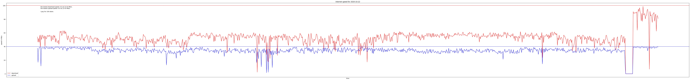

# A tool to monitor internet speeds and record them



## installing and running
* optional:
  [generate your API key from here first](https://developers.google.com/drive/api/v3/quickstart/python#step_1_turn_on_the)

```bash
cd ~
git clone git@github.com:jsphwllng/internet_monitor.git
pip3 install -r requirements.txt
*touch client_secrets.json (and add the contents from the credentials.json)
python3 application.py
```
*if you don't want to upload your files to google drive then skip this step

🤖📶 please let me know if this was useful for you
